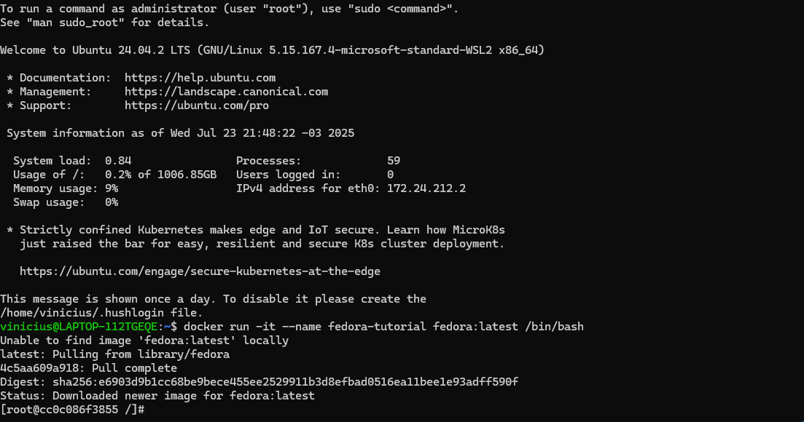
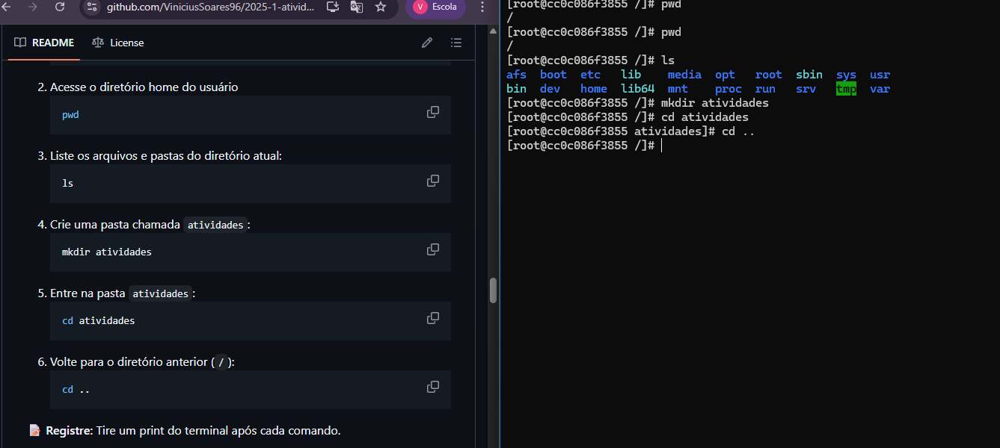
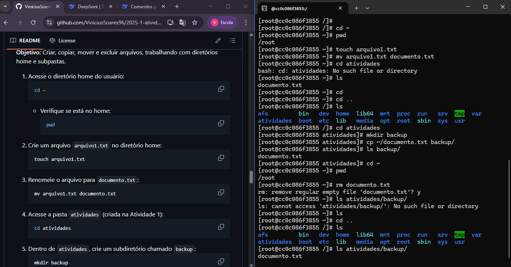
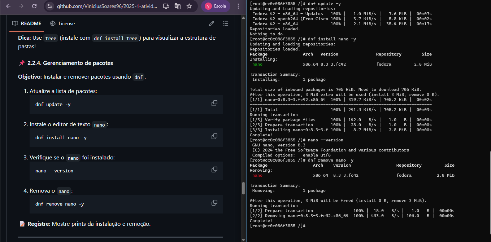
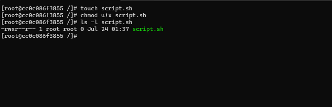
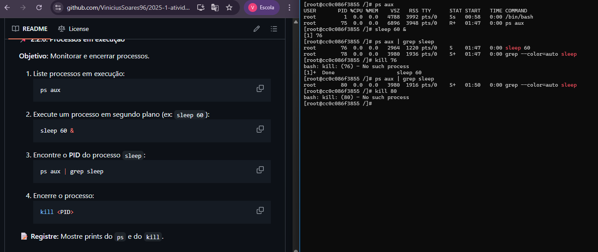
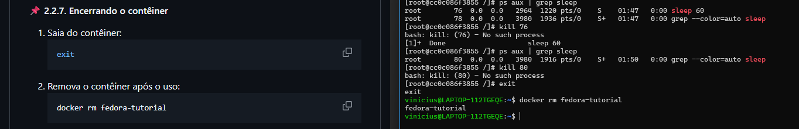

# Atividade de introdução Docker linux 

# Professor: Leonardo Minora 
# Aluno: Vinicius Vasconcelos

# Objetivo: Introdução ao linux usando Docker 

# 1 baixando imagem do fedora e rodando em modo interativo.

`docker run -it --name fedora-tutorial fedora:latest /bin/bash`

# 2 navegacao basica pelo terminal

# 3 criando e movendo arquivos pelas pastas usando o terminal

# 4 instalando e removendo ferramentas

# 5 Modificar permissões de arquivos.

# 6 Processos em execução

# 7 Encerrando o contêiner

# Conclusao: Nesta tarefa, pratiquei comandos básicos do Linux para navegar, criar, editar e mover arquivos, instalar programas pelo terminal e gerenciar processos. Usei o Fedora em um container no Windows. Tive algumas dificuldade para me localizar nos diretórios.